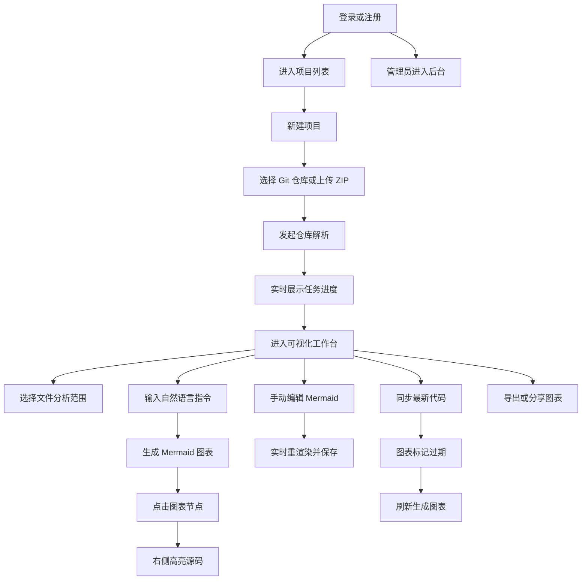

## 1. 产品概述
基于 AI 实现仓库业务流程可视化平台，面向研发团队、项目经理与管理员，帮助用户把代码仓库的业务流程、模块关系与关键节点转换为可理解、可追踪、可导出的可视化图表。
- 解决代码仓库结构复杂、业务流程难以梳理、跨角色协作成本高的问题，支持从仓库接入、解析、生成、编辑到导出分享的完整流程。
- 平台价值在于将“代码理解”与“业务可视化”合并为一体，降低新成员熟悉项目的门槛，并提升团队的分析效率与管理透明度。

## 2. 核心功能

### 2.1 用户角色
| 角色 | 注册方式 | 核心权限 |
|------|----------|----------|
| 普通用户 | 账号注册 | 登录平台、管理自己的项目、上传或连接仓库、发起解析、生成图表、编辑导出分享 |
| 管理员 | 由系统配置或后台授权 | 拥有普通用户全部能力，并可查看平台概览、用户数据、项目运行状态、任务监控 |

### 2.2 功能模块
1. **登录注册页**：用户登录、注册、身份校验、角色识别。
2. **项目列表页**：项目分页、搜索、新建项目、Git 仓库接入、ZIP 上传、项目管理。
3. **可视化工作台**：文件树、Mermaid 画布、源码面板、指令聊天面板、任务进度、导出分享。
4. **管理员后台**：平台统计、用户管理、项目任务监控、异常状态提示。

### 2.3 页面明细
| 页面名称 | 模块名称 | 功能描述 |
|-----------|-----------|-----------|
| 登录 / 注册页 | 登录表单 | 输入账号密码登录，提交后保存 JWT，登录失败展示中文错误提示 |
| 登录 / 注册页 | 注册表单 | 输入用户名、邮箱、密码完成注册，并支持切换到登录模式 |
| 登录 / 注册页 | 品牌介绍区 | 展示平台能力、核心价值、流程说明与引导文案 |
| 项目列表页 | 顶部操作栏 | 项目搜索、状态筛选、分页控制、刷新列表 |
| 项目列表页 | 项目卡片 / 表格 | 展示项目名称、来源类型、最近同步时间、解析状态、图表数量 |
| 项目列表页 | 新建项目弹窗 | 支持 Git 地址录入、ZIP 文件上传、描述输入、初始化创建 |
| 项目列表页 | 项目操作区 | 进入工作台、同步代码、编辑项目、删除项目 |
| 可视化工作台 | 文件树面板 | 以树形结构展示仓库目录，支持勾选分析范围、快速展开折叠 |
| 可视化工作台 | Mermaid 画布 | 渲染流程图、时序图、架构图，支持缩放、重绘、错误提示、节点点击 |
| 可视化工作台 | 聊天控制区 | 输入自然语言指令，选择图表类型，触发 AI 生成或更新图表 |
| 可视化工作台 | 源码面板 | 根据图表节点定位源码片段并高亮展示，只读查看 |
| 可视化工作台 | 进度条 | 展示解析、生成、同步等任务进度，支持 WebSocket 实时更新 |
| 可视化工作台 | Mermaid 编辑区 | 手动修改 Mermaid 文本，实时重渲染，支持保存 |
| 可视化工作台 | 导出分享弹窗 | 导出 SVG、PNG、PDF、Markdown，生成分享链接或复制分享信息 |
| 管理员后台 | 数据总览 | 展示用户数、项目数、任务数、成功率等统计 |
| 管理员后台 | 用户管理 | 展示用户列表、角色、状态、最近活跃时间 |
| 管理员后台 | 项目与任务监控 | 展示当前运行任务、异常任务、资源使用情况、项目状态分布 |

## 3. 核心流程
用户进入平台后完成登录或注册，登录成功后进入项目列表页。用户可创建项目，选择通过 Git 仓库地址或 ZIP 文件接入代码仓库，随后触发解析任务。平台通过实时进度条反馈解析状态，解析完成后进入工作台。

在工作台中，左侧文件树用于限定分析范围，中间 Mermaid 画布展示 AI 生成的业务流程图，右侧源码面板展示节点关联源码。用户可输入自然语言指令生成不同类型图表，也可手动编辑 Mermaid 文本并即时预览与保存。当仓库代码同步后，系统会将当前图表标记为过期，提示刷新重生成。最终用户可导出图表或生成分享链接。

管理员登录后可进入后台查看平台整体运行情况，包括用户数据、项目任务状态、异常任务与资源概览。

## 4. 用户界面设计
### 4.1 设计风格
- 主色采用深海蓝与青绿色强调，辅以高对比中性色，形成偏专业控制台风格。
- 按钮使用中等圆角、轻微发光边框和悬停渐变，强调“可操作”和“平台感”。
- 字体采用中文友好的系统无衬线组合，标题层级清晰，正文保持高可读性。
- 布局以桌面端优先，采用控制台式分区结构：首页双栏，工作台三栏，后台卡片网格。
- 图标建议使用线性风格，搭配少量状态徽标与语义色标签。

### 4.2 页面设计概览
| 页面名称 | 模块名称 | UI 元素 |
|-----------|-----------|-----------|
| 登录 / 注册页 | 双栏布局 | 左侧品牌说明与能力标签，右侧表单卡片、输入框、切换按钮、状态提示 |
| 项目列表页 | 顶部工具区 | 搜索框、筛选项、主要操作按钮、统计卡片 |
| 项目列表页 | 项目展示区 | 卡片化项目列表、状态标签、操作按钮、分页栏 |
| 可视化工作台 | 左侧文件树 | 深色侧边栏、树节点、复选框、筛选标签、折叠图标 |
| 可视化工作台 | 中央图表区 | Mermaid 渲染容器、工具栏、缩放按钮、编辑器、错误提示区 |
| 可视化工作台 | 右侧源码区 | 代码块、行号、高亮标记、节点信息摘要 |
| 可视化工作台 | 底部或浮层控制区 | 聊天输入框、图表类型选择、提交按钮、进度条、导出按钮 |
| 管理员后台 | 数据面板 | 统计卡片、表格、任务状态条、异常提醒、趋势区域 |

### 4.3 响应式设计
- 采用桌面端优先设计，优先保障 1280px 以上宽度下的完整三栏工作台体验。
- 平板宽度下将工作台右侧源码面板切换为抽屉模式，聊天与进度区压缩到下方。
- 移动端保留基础查看和管理能力，以单栏堆叠布局展示登录、项目列表和后台概览，不强制完整编辑体验。
- 所有交互控件保持足够点击区域，并兼容滚动容器中的操作。
