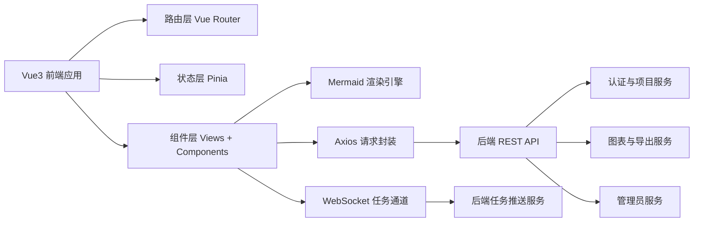
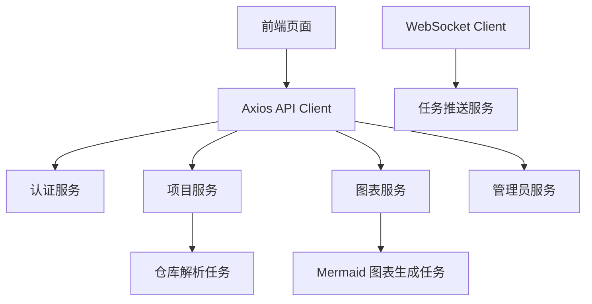
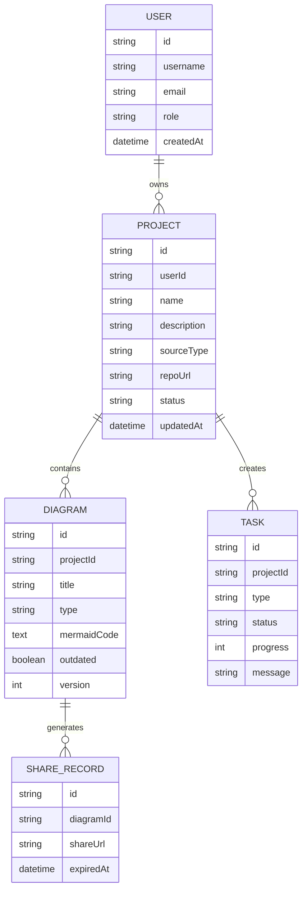

## 1. 架构设计


## 2. 技术说明
- 前端：Vue 3 + TypeScript + Vite + Pinia + Vue Router + Axios + Mermaid
- 初始化工具：Vite Vue TypeScript 模板
- 样式方案：原生 CSS + 结构化样式文件 + 设计令牌变量
- 代码规范：ESLint + Prettier + `script setup` + 中文注释与中文交互文案
- 状态管理：按业务域拆分为 `userStore`、`projectStore`、`taskStore`、`diagramStore`
- 网络层：统一 Axios 实例、请求拦截器、响应拦截器、统一错误提示与 Loading 状态
- 实时通信：WebSocket 用于任务进度更新、解析状态同步、图表生成状态推送
- 图表引擎：Mermaid 负责流程图、时序图、架构图渲染，支持重绘与导出

## 3. 路由定义
| 路由 | 用途 |
|------|------|
| /login | 登录与注册页面，未登录用户默认进入此页 |
| /projects | 项目列表页，管理个人项目、创建项目、搜索分页 |
| /workspace/:projectId | 可视化工作台，展示文件树、Mermaid 图表、源码面板与任务进度 |
| /admin | 管理员后台，展示平台概览、用户与任务监控 |

## 4. API 定义
### 4.1 统一响应结构
```ts
export interface ApiResponse<T> {
  code: number
  message: string
  data: T
  success: boolean
}
```

### 4.2 认证接口
```ts
export interface LoginRequest {
  email: string
  password: string
}

export interface RegisterRequest {
  username: string
  email: string
  password: string
}

export interface AuthUser {
  id: string
  username: string
  email: string
  role: 'user' | 'admin'
}

export interface LoginResponse {
  token: string
  user: AuthUser
}
```

### 4.3 项目接口
```ts
export interface ProjectItem {
  id: string
  name: string
  description: string
  sourceType: 'git' | 'zip'
  repoUrl?: string
  status: 'idle' | 'parsing' | 'ready' | 'outdated' | 'error'
  diagramCount: number
  updatedAt: string
  createdAt: string
}

export interface ProjectQuery {
  page: number
  pageSize: number
  keyword?: string
}
```

### 4.4 图表接口
```ts
export interface DiagramNodeSource {
  filePath: string
  startLine: number
  endLine: number
  code: string
}

export interface DiagramDetail {
  id: string
  projectId: string
  title: string
  type: 'flowchart' | 'sequenceDiagram' | 'classDiagram'
  mermaidCode: string
  version: number
  outdated: boolean
  updatedAt: string
}
```

### 4.5 接口清单
| 方法 | 路径 | 描述 |
|------|------|------|
| POST | /api/auth/login | 用户登录 |
| POST | /api/auth/register | 用户注册 |
| GET | /api/projects | 获取项目列表，支持分页与搜索 |
| POST | /api/projects | 创建项目 |
| PUT | /api/projects/:id | 更新项目 |
| DELETE | /api/projects/:id | 删除项目 |
| POST | /api/projects/:id/upload-zip | 上传 ZIP 仓库 |
| POST | /api/projects/:id/sync | 同步最新代码 |
| POST | /api/projects/:id/parse | 解析仓库 |
| GET | /api/projects/:id/tree | 获取文件树 |
| POST | /api/projects/:id/diagram/generate | 生成图表 |
| GET | /api/projects/:id/diagram | 获取图表详情 |
| PUT | /api/projects/:id/diagram/:diagramId | 保存 Mermaid 编辑结果 |
| POST | /api/projects/:id/diagram/:diagramId/export | 导出图表 |
| POST | /api/projects/:id/diagram/:diagramId/share | 生成分享信息 |
| GET | /api/admin/overview | 获取管理员概览数据 |
| GET | /api/admin/users | 获取管理员用户列表 |
| GET | /api/admin/tasks | 获取管理员任务列表 |
```

## 5. 服务端协作图


## 6. 数据模型
### 6.1 数据模型定义


### 6.2 前端模块映射
- `src/api`：封装认证、项目、图表、管理员接口，以及 Axios 实例与类型定义。
- `src/router`：定义业务路由、路由守卫、角色权限控制。
- `src/stores`：管理用户会话、项目数据、任务进度、图表内容与导出分享状态。
- `src/views`：实现 `LoginView.vue`、`ProjectListView.vue`、`WorkspaceView.vue`、`AdminDashboard.vue`。
- `src/components`：沉淀 `MermaidCanvas.vue`、`FileTree.vue`、`SourcePanel.vue`、`ChatPanel.vue`、`ProgressBar.vue`、`ExportDialog.vue` 以及基础 UI 组件。
- `src/utils`：放置鉴权工具、日期格式化、文件树转换、Mermaid 导出、代码高亮辅助函数。
- `src/styles`：存放全局变量、重置样式、布局样式与主题样式。

### 6.3 关键前端约束
- 所有受保护接口统一通过请求头附带 `Authorization: Bearer {token}`。
- 路由守卫对未登录用户强制跳转 `/login`，对非管理员访问 `/admin` 进行拦截。
- 工作台使用三栏布局，确保图表区域为核心焦点，文件树与源码面板支持独立滚动。
- Mermaid 编辑区与渲染区联动，编辑后立即重绘，并在保存时调用图表更新接口。
- 当代码同步后，项目状态与图表状态需更新为“已过期”，提示用户刷新图表。
- WebSocket 断开后自动重连，并在界面提供连接状态提示。
